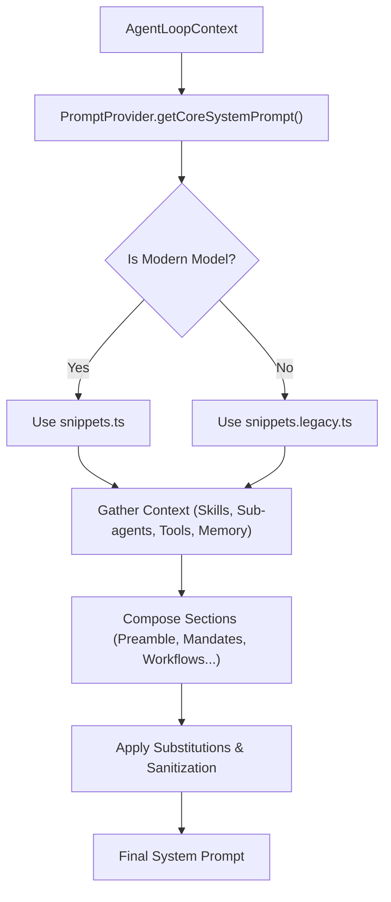

### Answer
Gemini CLI 的 Prompt 工程架构采用了一种**模块化组合机制**。它主要由 `PromptProvider` 类 gemini-cli:43-43  负责编排，通过将系统提示词拆分为多个功能片段（Snippets），根据当前使用的模型版本、运行模式（如 Plan 或 YOLO）以及环境上下文动态构建最终的 System Prompt gemini-cli:144-172 。

---

## 核心架构组件
### 1. Prompt 编排器 (`PromptProvider`)
`PromptProvider` 是生成提示词的核心类。它负责收集所有必要的信息，包括：

+ **模型识别**：区分现代模型（如 Gemini 1.5+）和旧版模型，选择不同的提示词片段 gemini-cli:81-82 。
+ **模式配置**：根据 `ApprovalMode`（Default, Plan, YOLO）调整 Preamble（前导词）内容 gemini-cli:59-62 gemini-cli:191-203 。
+ **环境感知**：注入当前工作目录、Git 仓库状态和任务追踪器路径 gemini-cli:85-92 gemini-cli:249-253 。

### 2. 模块化片段管理 (`Snippets`)
提示词被拆分为多个可复用的函数，这种设计遵循了“最小复杂度原则”：

+ **Preamble**: 定义 AI 身份和运行模式 gemini-cli:191-204 。
+ **Core Mandates**: 包含安全、上下文效率和工程标准等核心指令 gemini-cli:6-56 。
+ **Workflows**: 定义软件工程任务的生命周期（Understand -> Plan -> Implement -> Verify） gemini-cli:1152-1160 。

### 3. 分层上下文加载 (`GEMINI.md`)
系统支持从多个层级加载 `GEMINI.md` 文件，并将其合并到系统提示词中，优先级由具体到一般：

1. **全局**：`~/.gemini/GEMINI.md` gemini-cli:2695-2698 。
2. **项目/父目录**：从 CWD 向上查找至项目根目录 gemini-cli:2699-2704 。
3. **子目录**：自动扫描当前目录下的子目录以获取局部上下文 gemini-cli:2705-2713 。

### 4. 动态注入与替换
+ **变量替换**：支持在自定义 `system.md` 中使用 `${AgentSkills}` 或 `${SubAgents}` 等占位符动态注入功能模块 gemini-cli:63-76 。
+ **子代理与技能**：根据注册的工具和技能，动态渲染 `Available Sub-Agents` 和 `Agent Skills` 章节 gemini-cli:154-175 。

## 提示词生成流程


## Notes
+ **System.md vs GEMINI.md**: `system.md` 类似于“固件”，定义非协商的运行规则；而 `GEMINI.md` 侧重于策略、目标和项目特定的上下文 gemini-cli:105-116 。
+ **自动化测试**: 系统通过 `prompts.test.ts` 和快照测试（Snapshots）来确保提示词结构的稳定性 gemini-cli:1-4 。

Wiki pages you might want to explore:

+ [Agent Skills and Sub-agents (google-gemini/gemini-cli)](/wiki/google-gemini/gemini-cli#3.11)
+ [Behavioral Evaluations (Evals) (google-gemini/gemini-cli)](/wiki/google-gemini/gemini-cli#6.4)

### Citations
**File:** packages/core/src/prompts/promptProvider.ts (L43-43)

```typescript
export class PromptProvider {
```

**File:** packages/core/src/prompts/promptProvider.ts (L59-62)

```typescript
    const approvalMode =
      context.config.getApprovalMode?.() ?? ApprovalMode.DEFAULT;
    const isPlanMode = approvalMode === ApprovalMode.PLAN;
    const isYoloMode = approvalMode === ApprovalMode.YOLO;
```

**File:** packages/core/src/prompts/promptProvider.ts (L81-82)

```typescript
    const isModernModel = supportsModernFeatures(desiredModel);
    const activeSnippets = isModernModel ? snippets : legacySnippets;
```

**File:** packages/core/src/prompts/promptProvider.ts (L85-92)

```typescript
    let trackerDir = context.config.isTrackerEnabled()
      ? context.config.storage.getProjectTempTrackerDir()
      : undefined;

    if (trackerDir) {
      // Sanitize path to prevent prompt injection
      trackerDir = trackerDir.replace(/\n/g, ' ').replace(/\]/g, '');
    }
```

**File:** packages/core/src/prompts/promptProvider.ts (L154-175)

```typescript
        subAgents: this.withSection(
          'agentContexts',
          () =>
            context.config
              .getAgentRegistry()
              .getAllDefinitions()
              .map((d) => ({
                name: d.name,
                description: d.description,
              })),
          enabledToolNames.has(AGENT_TOOL_NAME),
        ),
        agentSkills: this.withSection(
          'agentSkills',
          () =>
            skills.map((s) => ({
              name: s.name,
              description: s.description,
              location: s.location,
            })),
          skills.length > 0,
        ),
```

**File:** packages/core/src/prompts/promptProvider.ts (L249-253)

```typescript
        gitRepo: this.withSection(
          'git',
          () => ({ interactive: interactiveMode }),
          isGitRepository(process.cwd()) ? true : false,
        ),
```

**File:** packages/core/src/prompts/snippets.ts (L144-172)

```typescript
export function getCoreSystemPrompt(options: SystemPromptOptions): string {
  return `
${renderPreamble(options.preamble)}

${renderCoreMandates(options.coreMandates)}

${renderSubAgents(options.subAgents)}

${renderAgentSkills(options.agentSkills)}

${renderHookContext(options.hookContext)}

${
  options.planningWorkflow
    ? renderPlanningWorkflow(options.planningWorkflow)
    : renderPrimaryWorkflows(options.primaryWorkflows)
}

${options.taskTracker ? renderTaskTracker(options.taskTracker) : ''}

${renderOperationalGuidelines(options.operationalGuidelines)}

${renderInteractiveYoloMode(options.interactiveYoloMode)}

${renderSandbox(options.sandbox)}

${renderGitRepo(options.gitRepo)}
`.trim();
}
```

**File:** packages/core/src/prompts/snippets.ts (L191-204)

```typescript
export function renderPreamble(options?: PreambleOptions): string {
  if (!options) return '';

  let modeStr = 'Default';
  if (options.approvalMode === 'plan') modeStr = 'Plan';
  if (options.approvalMode === 'yolo') modeStr = 'YOLO';
  if (options.approvalMode === 'autoEdit') modeStr = 'Auto-Edit';

  const base = options.interactive
    ? 'You are Gemini CLI, an interactive CLI agent specializing in software engineering tasks.'
    : 'You are Gemini CLI, an autonomous CLI agent specializing in software engineering tasks.';

  return `${base} You are currently operating in **${modeStr}** mode. Your primary goal is to help users safely and effectively.`;
}
```

**File:** packages/core/src/core/**snapshots**/prompts.test.ts.snap (L1-4)

```latex
// Vitest Snapshot v1, https://vitest.dev/guide/snapshot.html

exports[`Core System Prompt (prompts.ts) > ApprovalMode in System Prompt > Approved Plan in Plan Mode > should NOT include approved plan section if no plan is set in config 1`] = `
"You are Gemini CLI, an interactive CLI agent specializing in software engineering tasks. You are currently operating in **Plan** mode. Your primary goal is to help users safely and effectively.
```

**File:** packages/core/src/core/**snapshots**/prompts.test.ts.snap (L6-56)

```latex
# Core Mandates

## Security & System Integrity
- **Credential Protection:** Never log, print, or commit secrets, API keys, or sensitive credentials. Rigorously protect \`.env\` files, \`.git\`, and system configuration folders.
- **Source Control:** Do not stage or commit changes unless specifically requested by the user.

## Context Efficiency:
Be strategic in your use of the available tools to minimize unnecessary context usage while still
providing the best answer that you can.

Consider the following when estimating the cost of your approach:
<estimating_context_usage>
- The agent passes the full history with each subsequent message. The larger context is early in the session, the more expensive each subsequent turn is.
- Unnecessary turns are generally more expensive than other types of wasted context.
- You can reduce context usage by limiting the outputs of tools but take care not to cause more token consumption via additional turns required to recover from a tool failure or compensate for a misapplied optimization strategy.
</estimating_context_usage>
Use the following guidelines to optimize your search and read patterns.
<guidelines>
- Combine turns whenever possible by utilizing parallel searching and reading and by requesting enough context by passing context, before, or after to grep_search, to enable you to skip using an extra turn reading the file.
- Prefer using tools like grep_search to identify points of interest instead of reading lots of files individually.
- If you need to read multiple ranges in a file, do so parallel, in as few turns as possible.
- It is more important to reduce extra turns, but please also try to minimize unnecessarily large file reads and search results, when doing so doesn't result in extra turns. Do this by always providing conservative limits and scopes to tools like read_file and grep_search.
- replace fails if old_string is ambiguous, causing extra turns. Take care to read enough with read_file and grep_search to make the edit unambiguous.
- You can compensate for the risk of missing results with scoped or limited searches by doing multiple searches in parallel.
- Your primary goal is still to do your best quality work. Efficiency is an important, but secondary concern.
</guidelines>
<examples>
- **Searching:** utilize search tools like grep_search and glob with a conservative result count (\`total_max_matches\`) and a narrow scope (\`include_pattern\` and \`exclude_pattern\` parameters).
- **Searching and editing:** utilize search tools like grep_search with a conservative result count and a narrow scope. Use \`context\`, \`before\`, and/or \`after\` to request enough context to avoid the need to read the file before editing matches.
- **Understanding:** minimize turns needed to understand a file. It's most efficient to read small files in their entirety.
- **Large files:** utilize search tools like grep_search and/or read_file called in parallel with 'start_line' and 'end_line' to reduce the impact on context. Minimize extra turns, unless unavoidable due to the file being too large.
- **Navigating:** read the minimum required to not require additional turns spent reading the file.
</examples>
## Engineering Standards
- **Contextual Precedence:** Instructions found in \`GEMINI.md\` files are foundational mandates. They take absolute precedence over the general workflows and tool defaults described in this system prompt.
- **Conventions & Style:** Rigorously adhere to existing workspace conventions, architectural patterns, and style (naming, formatting, typing, commenting). During the research phase, analyze surrounding files, tests, and configuration to ensure your changes are seamless, idiomatic, and consistent with the local context. Never compromise idiomatic quality or completeness (e.g., proper declarations, type safety, documentation) to minimize tool calls; all supporting changes required by local conventions are part of a surgical update.
- **Types, warnings and linters:** NEVER use hacks like disabling or suppressing warnings, bypassing the type system (e.g.: casts in TypeScript), or employing "hidden" logic (e.g.: reflection, prototype manipulation) unless explicitly instructed to by the user. Instead, use explicit and idiomatic language features (e.g.: type guards, explicit class instantiation, or object spread) that maintain structural integrity and type safety.
- **Design Patterns:** Prioritize explicit composition and delegation (e.g.: wrapper classes, proxies, or factory functions) over complex inheritance or prototype-based cloning. When extending or modifying existing classes, prefer patterns that are easily traceable and type-safe.
- **Libraries/Frameworks:** NEVER assume a library/framework is available. Verify its established usage within the project (check imports, configuration files like 'package.json', 'Cargo.toml', 'requirements.txt', etc.) before employing it.
- **Technical Integrity:** You are responsible for the entire lifecycle: implementation, testing, and validation. Within the scope of your changes, prioritize readability and long-term maintainability by consolidating logic into clean abstractions rather than threading state across unrelated layers. Align strictly with the requested architectural direction, ensuring the final implementation is focused and free of redundant "just-in-case" alternatives. Validation is not merely running tests; it is the exhaustive process of ensuring that every aspect of your change—behavioral, structural, and stylistic—is correct and fully compatible with the broader project. For bug fixes, you must empirically reproduce the failure with a new test case or reproduction script before applying the fix.
- **Expertise & Intent Alignment:** Provide proactive technical opinions grounded in research while strictly adhering to the user's intended workflow. Distinguish between **Directives** (unambiguous requests for action or implementation) and **Inquiries** (requests for analysis, advice, or observations, e.g., "Can you tell me how to"). Assume all requests are Inquiries unless they contain an explicit instruction to perform a task. For Inquiries, or whenever the user explicitly instructs you NOT to make changes just yet (e.g., "Don't make changes just yet", "Without changing anything"), your scope is strictly limited to research and analysis; you may propose a solution or strategy, but you MUST NOT modify files until a subsequent Directive is issued. Do not initiate implementation based on  ... (truncated)
- **Proactiveness:** When executing a Directive, persist through errors and obstacles by diagnosing failures in the execution phase and, if necessary, backtracking to the research or strategy phases to adjust your approach until a successful, verified outcome is achieved. Fulfill the user's request thoroughly, including adding tests when adding features or fixing bugs. Take reasonable liberties to fulfill broad goals while staying within the requested scope; however, prioritize simplicity and the removal of redundant logic over providing "just-in-case" alternatives that diverge from the established path.
- **Testing:** ALWAYS search for and update related tests after making a code change. You must add a new test case to the existing test file (if one exists) or create a new test file to verify your changes.
- **User Hints:** During execution, the user may provide real-time hints (marked as "User hint:" or "User hints:"). Treat these as high-priority but scope-preserving course corrections: apply the minimal plan change needed, keep unaffected user tasks active, and never cancel/skip tasks unless cancellation is explicit for those tasks. Hints may add new tasks, modify one or more tasks, cancel specific tasks, or provide extra context only. If scope is ambiguous, ask for clarification before dropping work.
- **Confirm Ambiguity/Expansion:** Do not take significant actions beyond the clear scope of the request without confirming with the user. If the user implies a change (e.g., reports a bug) without explicitly asking for a fix, **ask for confirmation first**. If asked *how* to do something, explain first, don't just do it.
- **Explain Before Acting:** Never call tools in silence. You MUST provide a concise, one-sentence explanation of your intent or strategy immediately before executing tool calls. This is essential for transparency, especially when confirming a request or answering a question. Silence is only acceptable for repetitive, low-level discovery operations (e.g., sequential file reads) where narration would be noisy.
- **Explaining Changes:** After completing a code modification or file operation *do not* provide summaries unless asked.
- **Do Not revert changes:** Do not revert changes to the codebase unless asked to do so by the user. Only revert changes made by you if they have resulted in an error or if the user has explicitly asked you to revert the changes.
```

**File:** packages/core/src/core/**snapshots**/prompts.test.ts.snap (L1152-1160)

```latex
## Software Engineering Tasks
When requested to perform tasks like fixing bugs, adding features, refactoring, or explaining code, follow this sequence:
1. **Understand:** Think about the user's request and the relevant codebase context. Use 'grep_search' and 'glob' search tools extensively (in parallel if independent) to understand file structures, existing code patterns, and conventions.
Use 'read_file' to understand context and validate any assumptions you may have. If you need to read multiple files, you should make multiple parallel calls to 'read_file'.
2. **Plan:** Build a coherent and grounded (based on the understanding in step 1) plan for how you intend to resolve the user's task. If the user's request implies a change but does not explicitly state it, **YOU MUST ASK** for confirmation before modifying code. Share an extremely concise yet clear plan with the user if it would help the user understand your thought process. As part of the plan, you should use an iterative development process that includes writing unit tests to verify your changes. Use output logs or debug statements as part of this process to arrive at a solution.
3. **Implement:** Use the available tools (e.g., 'replace', 'write_file' 'run_shell_command' ...) to act on the plan. Strictly adhere to the project's established conventions (detailed under 'Core Mandates'). Before making manual code changes, check if an ecosystem tool (like 'eslint --fix', 'prettier --write', 'go fmt', 'cargo fmt') is available in the project to perform the task automatically.
4. **Verify (Tests):** If applicable and feasible, verify the changes using the project's testing procedures. Identify the correct test commands and frameworks by examining 'README' files, build/package configuration (e.g., 'package.json'), or existing test execution patterns. NEVER assume standard test commands. When executing test commands, prefer "run once" or "CI" modes to ensure the command terminates after completion.
5. **Verify (Standards):** VERY IMPORTANT: After making code changes, execute the project-specific build, linting and type-checking commands (e.g., 'tsc', 'npm run lint', 'ruff check .') that you have identified for this project (or obtained from the user). This ensures code quality and adherence to standards. If unsure about these commands, you can ask the user if they'd like you to run them and if so how to.
6. **Finalize:** After all verification passes, consider the task complete. Do not remove or revert any changes or created files (like tests). Await the user's next instruction.
```

**File:** docs/reference/configuration.md (L2695-2698)

```markdown
  1.  **Global context file:**
      - Location: `~/.gemini/<configured-context-filename>` (for example,
        `~/.gemini/GEMINI.md` in your user home directory).
      - Scope: Provides default instructions for all your projects.
```

**File:** docs/reference/configuration.md (L2699-2704)

```markdown
  2.  **Project root and ancestors context files:**
      - Location: The CLI searches for the configured context file in the
        current working directory and then in each parent directory up to either
        the project root (identified by a `.git` folder) or your home directory.
      - Scope: Provides context relevant to the entire project or a significant
        portion of it.
```

**File:** docs/reference/configuration.md (L2705-2713)

```markdown
  3.  **Sub-directory context files (contextual/local):**
      - Location: The CLI also scans for the configured context file in
        subdirectories _below_ the current working directory (respecting common
        ignore patterns like `node_modules`, `.git`, etc.). The breadth of this
        search is limited to 200 directories by default, but can be configured
        with the `context.discoveryMaxDirs` setting in your `settings.json`
        file.
      - Scope: Allows for highly specific instructions relevant to a particular
        component, module, or subsection of your project.
```

**File:** docs/cli/system-prompt.md (L63-76)

```markdown
When using a custom system prompt file, you can use the following variables to
dynamically include built-in content:

- `${AgentSkills}`: Injects a complete section (including header) of all
  available agent skills.
- `${SubAgents}`: Injects a complete section (including header) of available
  sub-agents.
- `${AvailableTools}`: Injects a bulleted list of all currently enabled tool
  names.
- Tool Name Variables: Injects the actual name of a tool using the pattern:
  `${toolName}_ToolName` (for example, `${write_file_ToolName}`,
  `${run_shell_command_ToolName}`).

  This pattern is generated dynamically for all available tools.
```

**File:** docs/cli/system-prompt.md (L105-116)

```markdown
## Best practices: system.md vs GEMINI.md

- system.md (firmware):
  - Non‑negotiable operational rules: safety, tool‑use protocols, approvals, and
    mechanics that keep the CLI reliable.
  - Stable across tasks and projects (or per project when needed).
- GEMINI.md (strategy):
  - Persona, goals, methodologies, and project/domain context.
  - Evolves per task; relies on system.md for safe execution.

Keep system.md minimal but complete for safety and tool operation. Keep
GEMINI.md focused on high‑level guidance and project specifics.
```


# 你通读三款源码后，三者<font style="color:rgb(0, 0, 0);background-color:rgba(0, 0, 0, 0);">Prompt 工程架构</font>有什么本质区别？谁做了分层 Prompt、谁是硬编码拼接、谁支持动态路由 Prompt？


这三个工具在 Prompt 工程架构上体现了完全不同的设计哲学。如果要用一句话概括，那就是：**Gemini CLI 是“框架约定”，Claude Code 是“乐高积木”，而 OpenCode 是“夹心三明治”**。下面我们来逐一拆解。

### 🔬 本质区别一览
下表概括了三者在核心架构上的根本性差异：

| 维度 | Claude Code (Anthropic) | Gemini CLI (Google) | OpenCode (SST) |
| :--- | :--- | :--- | :--- |
| **核心架构** | **模块化、动态组装** (乐高积木) | **分层、片段式组合** (框架约定) | **硬编码拼接** (夹心三明治) |
| **是否分层** | 是，五层以上的精细分层 | 是，清晰的三层架构 | 不是，通过`<system-reminder>`标签注入 |
| **是否硬编码** | 不完全是，通过注册机制管理 | 不是，片段化组合，有条件剔除 | **是，大量硬编码规则** |
| **动态路由** | **是，最核心特征** (数百个碎片运行时动态组装) | **是，基于模式驱动** | **否，以规则和状态感知为主** |
| **工具提示** | 独立Prompt，高度结构化 | 通过`toolRegistry`动态注入 | 内嵌规范，强调并行执行 |


---

### ⚡️ 一、Gemini CLI: 框架约定的分层组合
Gemini CLI 的 Prompt 系统很像一个遵循框架约定的组装流水线，其 Prompt 生成逻辑被清晰地**分为了三层**：入口层 (Entry Point)、编排层 (Orchestration) 和组合层 (Composition)。

+ **核心机制**：它的 Prompt 由众多**可插拔的“片段”（Snippet）** 组成。`PromptProvider` 作为总指挥，会根据当前的**批准模式 (Approval Mode)** 和可用工具，动态决定哪些片段该“上场”，哪些该“下场”。例如，在`PLAN`模式下，系统会自动注入只读工具列表并限制文件写入目录。
+ **实现方式**：每个功能模块（如核心原则、操作指南、沙盒模式）都有自己独立的渲染函数，通过条件判断 (`withSection`) 来决定是否包含。这种方式使系统指令像一份灵活的配置清单，**高内聚低耦合**，但其灵活性严格受限于 Google 为 Gemini API 设定的框架。

---

### 🎯 二、Claude Code: 乐高积木式的动态路由
如果说 Gemini CLI 是按清单组装，那 Claude Code 就是一场彻底的“动态即兴创作”。

+ **没有固定的系统提示词**：它的 Prompt 体系由**五层以上**的运行时协议构成，包括主系统 Prompt、动态 System Section、工具 Prompt 和任务型 Prompt 等。
+ **核心机制**：Claude Code 从**数百个提示词碎片**中，在运行时根据当前模式、工具集合和上下文，像一个**高级路由系统**一样，动态组装出最终的系统提示。例如，当使用 `BashTool` 时，它的专属 Prompt 才会被注入，告诉模型何时使用以及注意事项。
+ **工具提示集成**：这种架构的工程实现非常极致，每一个**工具都自带模型侧说明**。工具配置目录下都会有专门的 `prompt.ts` 文件，做到**能力和指令的内聚**。

---

### 🥪 三、OpenCode: 夹心三明治式的硬编码拼接
与前两者相比，OpenCode 的 Prompt 体系更“简单粗暴”，像一份硬编码的“夹心三明治”。

+ **核心机制**：在发送给 AI 前，OpenCode 的客户端会通过**硬编码规则**，自动将`<system-reminder>`标签 “夹带” 进去，最终形成一个`用户输入 + 工具结果 + 系统提醒`的“三明治”结构。
+ **提醒生成逻辑**：这些`<system-reminder>`的来源，虽然核心基于**硬编码规则**，但也开始引入环境感知。它能感知光标位置、终端报错等 IDE 状态。更高级的是，它甚至会调用一个本地小模型，对用户意图进行预处理，并生成相应的安全提示。
+ **工具规范**：它的工具规范内嵌在系统指令中，**硬性规定 AI 必须使用并行调用**。其 Prompt 核心思想是：“**不要问我，去做！尽可能并行执行！**”。

### 💎 总结
+ 选择 **Gemini CLI**，就是选择一个设计良好、职责清晰的“框架”，遵循其约定即可稳定运行。
+ 选择 **Claude Code**，就是选择极致的性能与灵活性，享受一个庞大、动态的“生态系统”带来的强大能力。
+ 选择 **OpenCode**，就是选择一个简单透明、易于理解和二次开发的“工具箱”，但同时也要接受其相对硬编码的方式。

